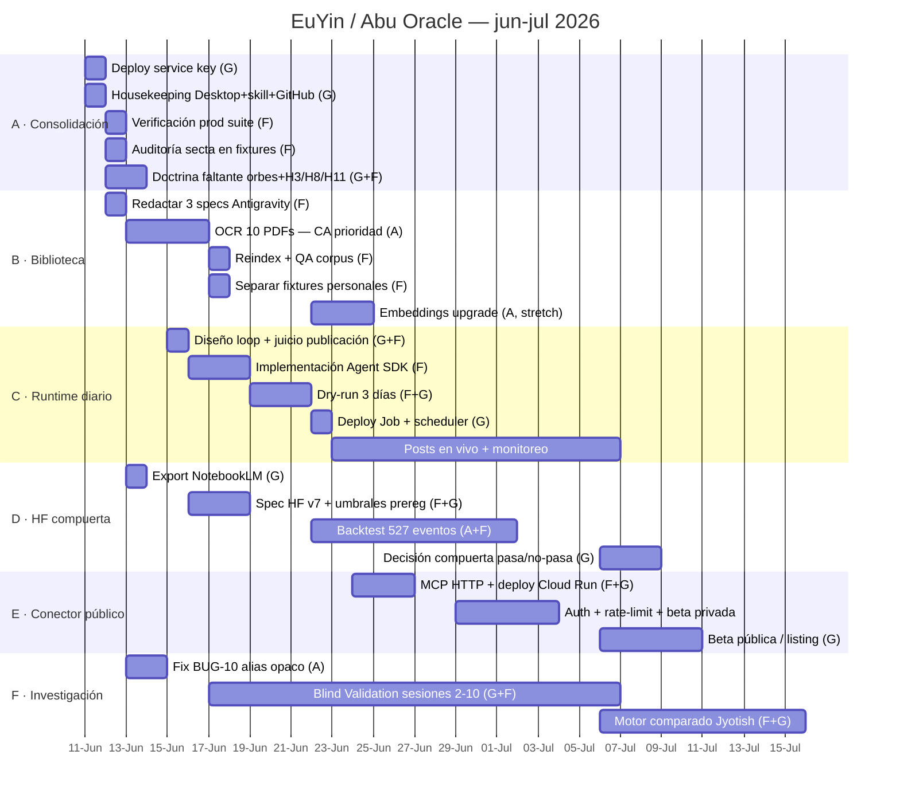

# Roadmap EuYin / Abu Oracle — junio-julio 2026

> Fuente de verdad del plan. Actualizado: 2026-06-11.
> Calibración: tareas medidas en **días/sesiones** (trabajo diario con agentes).
> Owners: **G** = Guillermo (decisiones, deploys, doctrina) · **F** = Fable/Claude Code
> (arquitectura, juicio doctrinal) · **A** = Antigravity vía spec (mecánico espec-able).

## Criterio de delegación a Antigravity

**Se delega** lo espec-able y verificable mecánicamente: OCR, runners de backtest,
embeddings, fixes con tests claros. **No se delega**: juicio doctrinal (skill,
secta, correcciones de corpus), arquitectura/auth, prompts de Lilly, decisiones
de producto.

Flujo: F redacta spec en `ai-oracle/.claude/specs/active/SPEC-*.md` → Antigravity
ejecuta → review acá (F) → merge → spec a `specs/done/`.

**Specs a redactar primero (12-jun):**
| Spec | Contenido | Verificación |
|---|---|---|
| `SPEC-OCR-01` | OCR (tesseract/PyMuPDF) de los 10 PDFs sin capa de texto en `astro-texts/` — prioridad 1: `Lilly_William-Christian_astrology.pdf` (444 págs) | texto extraído >200 chars/pág en muestreo; reindex produce chunks CA |
| `SPEC-BV-ALIAS-01` | BUG-10: alias opaco `NTV-{hash[:4]}` en run_blind_validation.py + limpieza de campos identificables | stdout sin subject_real ni ciudad; test incluido |
| `SPEC-HF-BACKTEST-01` | Runner de backtest HF v7 contra 527 eventos held-out (cuando D2 defina la spec del algoritmo) | métricas reproducibles, seed fija, reporte JSON |

## Gantt

## Dependencias duras

- `A1 → A3 → linea_biografica en prod` (sin deploy de la key, la tool solo anda local)
- `B1 → B2 → B3` (el OCR alimenta el reindex)
- `B4 → E1` (**privacidad**: no exponer el MCP público con fixtures personales en el corpus)
- `D1 → D2 → D3 → D4` (sin export de NotebookLM no hay spec HF v7)
- `F1 → F2` (BUG-10 bloquea Blind Validation)
- `C4` y `E1` requieren deploys de G

## Hitos

| Fecha | Hito |
|---|---|
| 12-jun | linea_biografica viva en producción |
| 17-jun | Christian Astrology completa en la biblioteca |
| 22-jun | EuYin publica sola (runtime en producción) |
| ~3-jul | Backtest HF v7 terminado → datos para la compuerta |
| ~10-jul | Conector público en beta |
| ~17-jul | Primer experimento Motor Comparado (Lilly vs Jyotish) |

## Backlog sin fecha (se prioriza al cerrar lo anterior)

- BUG-04 (LINK_LOST /api/chat) · BUG-09 (errores form genéricos) — delegables vía spec
- Eval loop formal de la skill (iteration-2 con feedback de uso real) + description optimization
- Tool `puntaje_dominio` (HF por ciudad vía /api/astro/domain-score)
- Astrología horaria (prioridad 5 del roadmap de Lilly)
- OIDC para reemplazar service key estática (madurez de seguridad)
- arXiv Blind Validation (requiere F2 ≥ 10 sesiones)
