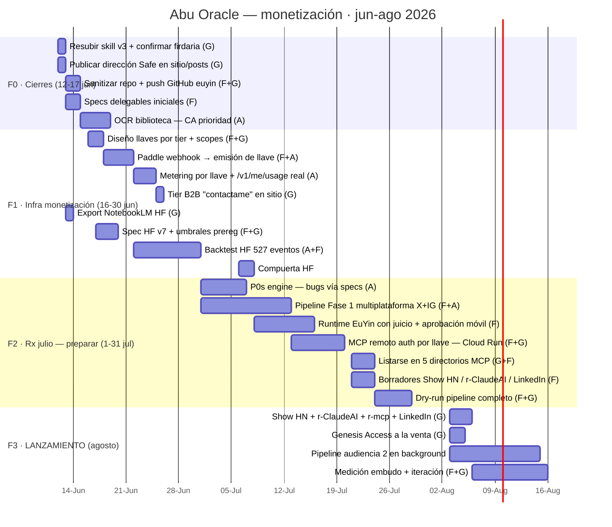

# Roadmap EuYin / Abu Oracle — v2 · eje: MONETIZACIÓN

> Fuente de verdad del plan. v2: 2026-06-12 (reemplaza v1 — ver git history).
> Estrategia base: diálogo monetización post-MCP (2026-06-12). Objetivo:
> **lanzamiento agosto 2026** — Genesis Access a la venta + MCP público.
> Calibración: días/sesiones. Owners: **G** = Guillermo (decisiones, deploys,
> publicación) · **F** = Fable/Claude Code (arquitectura, juicio, specs) ·
> **A** = agente delegado vía spec (**Antigravity o Aider+Vertex AI**, indistinto —
> mismo criterio: espec-able y verificable se delega; juicio doctrinal/auth no).

## Tesis comercial (del diálogo 2026-06-12)

- El MCP convierte a Abu Oracle de **destino en infraestructura**: el motor vive
  donde la pregunta ocurre. La web no muere: **MCP distribuye, web convierte y cobra**.
- **El patrón de monetización ya existe**: endpoints gratis (cielo, mundana) +
  endpoints con llave (natal, biografía, HF). `Paddle → emisión de llave` =
  suscripción por capacidad. Tiers ya cargados: $5/mes · $45/año · $100 lifetime
  ×100 Genesis (venderlo como pertenencia, no descuento). Falta: tier **B2B/API**
  ($50-200/mes) como "contactame".
- **Dos audiencias, orden inverso al intuitivo**: (1) builders AI — atacable YA
  sin audiencia previa (Show HN, r/ClaudeAI, r/mcp, LinkedIn, directorios MCP:
  registry oficial, Smithery, PulseMCP, mcp.so, Glama); (2) consumidores
  astrología — se construye con meses de pipeline multiplataforma.
- **Safe Wallet = carril value-for-value paralelo** (publicar dirección: costo
  cero, hoy). El ingreso principal es Paddle. Cripto-rieles nuevos: NO hasta
  que el carril 1 facture.
- **HF v1 consistente = corazón del tier pago** (relocalización es la killer
  feature). Antiscios y aspectos nuevos = v2, cuando un suscriptor los pida.
- Timing propio del sistema: julio = Mercurio Rx (revisión, P0s, preparación);
  agosto = Mercurio directo + firdaria Sol/Marte (30-jul) → **lanzamiento**.

## KPIs (empezar a medir desde Fase 1)

| Métrica | Fuente | Baseline 12-jun | Meta 31-ago |
|---|---|---|---|
| Directorios MCP listados | manual | 0 | 5 |
| Instalaciones/usuarios MCP | logs engine (por key) | 1 (Guillermo) | 50 |
| Llaves emitidas (free→paid) | Firestore | 0 | 100 free · 10 paid |
| MRR | Paddle | $0 | primer MRR > $0 |
| Genesis vendidos | Paddle/Safe | 0 | 5 |
| Seguidores pipeline | Bluesky+X+IG | 13 | 300 |
| Donaciones Safe | on-chain | 0 | medir (sin meta) |

## Gantt

## Dependencias duras

- `m1 → m2 → m3` y `m2 → p4` (el MCP remoto autenticado usa la MISMA infra de
  llaves — el conector público autenticado ES el producto B2B)
- `f03 (repo público sanitizado, sin fixtures personales ni secretos) → p5 (directorios)`
- `h1 (export NotebookLM — solo G puede) → h2 → h3 → h4`. Si la compuerta NO pasa,
  el lanzamiento sale igual: el tier pago lidera con natal+biografía y el HF queda
  "en validación" (regla content_generator: capacidad, no números)
- `p2/p3 → p7 → l3` · `p6 → l1` · julio Rx = preparar, NO lanzar; agosto = lanzar

## Postergado explícito (disciplina de foco)

- Antiscios + aspectos nuevos del HF → cuando un suscriptor pagante los pida
- Rieles cripto/ERC-8004 → cuando el carril Paddle facture
- Motor Doctrinal Comparado (Jyotish) → post-lanzamiento (sigue siendo el norte académico)
- Blind Validation / arXiv → continúa de fondo, sin fecha en este ciclo
- Embeddings biblioteca → cuando la recuperación BM25 quede corta en uso pago

## Specs para el delegado (Antigravity / Aider+Vertex)

| Spec | Fase | Contenido | Verificación |
|---|---|---|---|
| `SPEC-OCR-01` | F0 | OCR 10 PDFs sin texto (prioridad: Christian Astrology) | >200 chars/pág muestreados; reindex con chunks CA |
| `SPEC-KEYS-01` | F1 | Webhook Paddle → crear API key en Firestore + email Resend (sobre el patrón crypto-payment existente) | test e2e sandbox Paddle; key emitida funciona contra endpoint protegido |
| `SPEC-METER-01` | F1 | Metering por key + `/api/v1/me/usage` real (hoy devuelve mock) | usage refleja llamadas reales por key |
| `SPEC-P0S-01` | F2 | BUG-04 (LINK_LOST), BUG-09 (errores form), BUG-10 (alias BV) | repro + test por bug |
| `SPEC-HF-BACKTEST-01` | F1 | Runner backtest HF v7 vs 527 eventos held-out (espera spec h2) | métricas reproducibles, seed fija, JSON |
| `SPEC-PIPE-01` | F2 | Publishers X + Instagram sobre kernel existente + cola de aprobación | dry-run multiplataforma con drafts |
